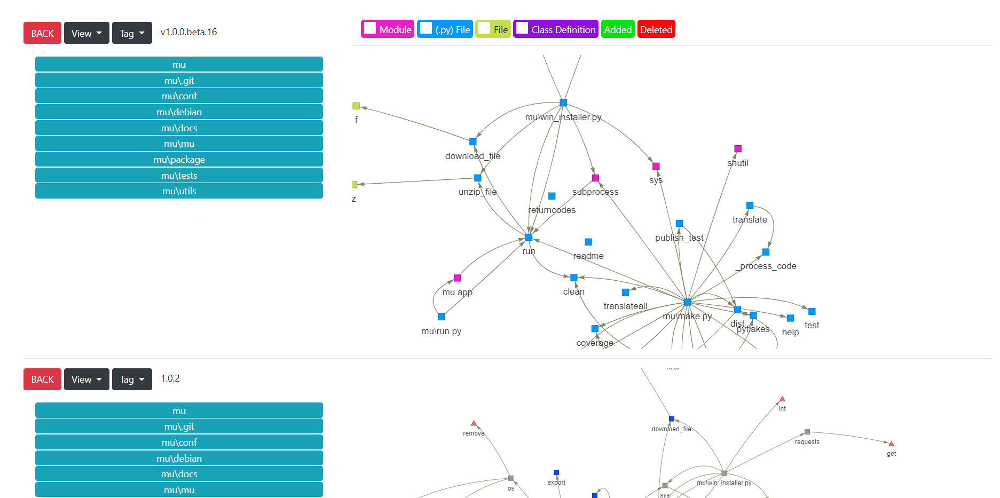
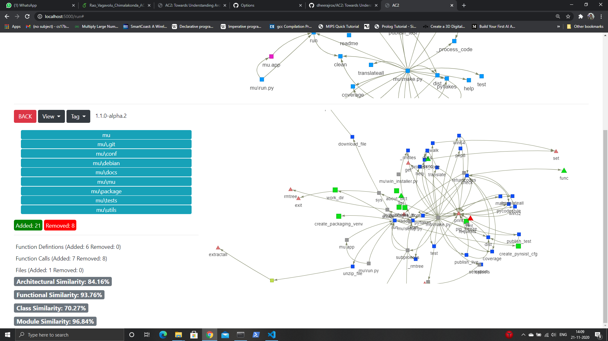

# AC2
> Towards Understanding Architectural Changes in Python Projects


## Directory Structure

# main

* [file_map_engine/](.\main\file_map_engine)
  * [ast_engine.py](.\main\file_map_engine\ast_engine.py)
  * [ast_helper.py](.\main\file_map_engine\ast_helper.py)
  * [call_dir.py](.\main\file_map_engine\call_dir.py)
  * [engine.py](.\main\file_map_engine\engine.py)
  * [test.ipynb](.\main\file_map_engine\test.ipynb)
* [static/](.\main\static)
  * [cohesion_python-fire_v0.1.0](.\main\static\cohesion_python-fire_v0.1.0)
  * [cohesion_python-fire_v0.1.1](.\main\static\cohesion_python-fire_v0.1.1)
  * [cohesion_python-fire_v0.1.2](.\main\static\cohesion_python-fire_v0.1.2)
  * [cohesion_python-fire_v0.1.3](.\main\static\cohesion_python-fire_v0.1.3)
  * [cohesion_python-fire_v0.2.0](.\main\static\cohesion_python-fire_v0.2.0)
  * [cohesion_python-fire_v0.2.1](.\main\static\cohesion_python-fire_v0.2.1)
  * [cohesion_python-fire_v0.3](.\main\static\cohesion_python-fire_v0.3)
  * [cohesion_python-fire_v0.3.0](.\main\static\cohesion_python-fire_v0.3.0)
  * [cohesion_python-fire_v0.3.1](.\main\static\cohesion_python-fire_v0.3.1)
* [target_repo_dir/](.\main\target_repo_dir)
  * [tags.txt](.\main\target_repo_dir\tags.txt)
* [templates/](.\main\templates)
  * [home.html](.\main\templates\home.html)
  * [index.html](.\main\templates\index.html)
* [ast_map.dat](.\main\ast_map.dat)
* [directory_map.dat](.\main\directory_map.dat)
* [main.py](.\main\main.py)
* [requirements.txt](.\main\requirements.txt)


## Installation

Clone or download this github repository:

```sh
git clone https://github.com/dheerajrox/AC2.git
```

Get into the main directory:

```sh
cd AC2/src/main
```

Install the requirements:

```sh
pip install -r requirements.txt
```

## Usage example

To start the server use the following command:

```sh
python main.py
```

Then, open your browser to 'http://localhost:5000/'

> #### Enter a Python Github Repository link and press enter to generate annotated graphs in available views.


> #### Compare two different versions of a repository by their respective annotated call graphs and collaboration graphs


## Meta

Developed by:
DHEERAJ VAGAVOLU 
dheerajrox98@gmail.com

Research in Intelligent Software and Human Analytics (RISHA) Lab, Indian Institute of Technology Tirupati

Team:
Dheeraj Vagavolu, A Eashaan Rao and Sridhar Chimalakonda


