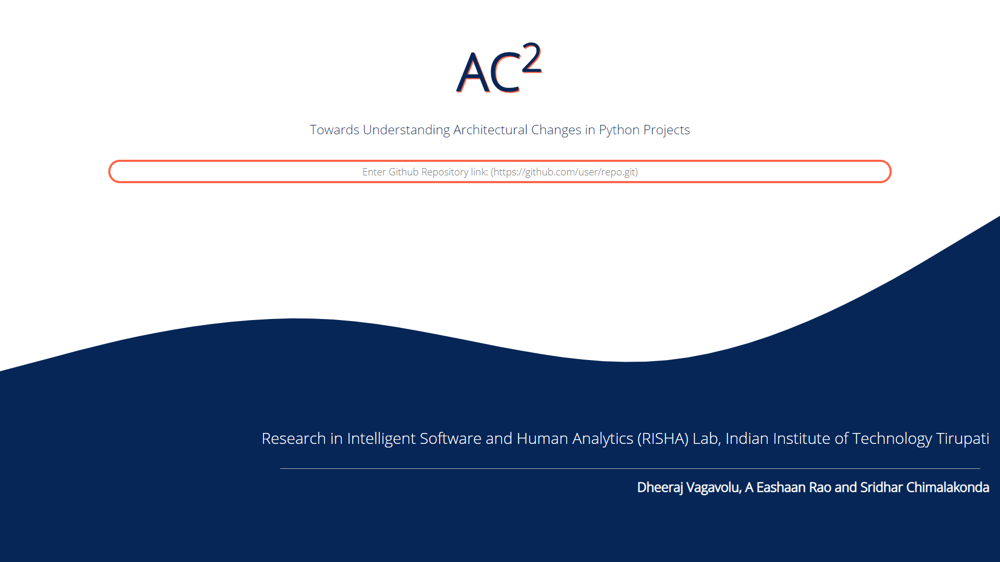
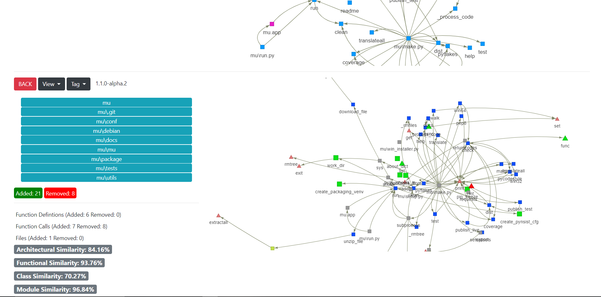

# AC2

> Towards Understanding Architectural Changes in Python Projects



## Directory Structure

- [file_map_engine/](.\main\file_map_engine)
  - [ast_engine.py](.\main\file_map_engine\ast_engine.py)
  - [ast_helper.py](.\main\file_map_engine\ast_helper.py)
  - [call_dir.py](.\main\file_map_engine\call_dir.py)
  - [engine.py](.\main\file_map_engine\engine.py)
  - [test.ipynb](.\main\file_map_engine\test.ipynb)
- [static/](.\main\static)
  - [This directory contains the cohesion data for the target repository]
- [target_repo_dir/](.\main\target_repo_dir)
  - [tags.txt](.\main\target_repo_dir\tags.txt)
- [templates/](.\main\templates)
  - [home.html](.\main\templates\home.html)
  - [index.html](.\main\templates\index.html)
- [main.py](.\main\main.py)
- [requirements.txt](.\main\requirements.txt)

## Cohesion value interpretation (Using lcom)

Score:

- `==1` - indicates a cohesive class, which is the "good" class;
- `>=2` - indicates a problem. The class should be split into so many smaller classes;
- `==0` - happens when there are no methods in a class. This is also a "bad" class.

## Installation

Clone or download this github repository:

```sh
git clone https://github.com/dheerajrox/AC2.git
```

Get into the main directory:

```sh
cd AC2/src/main
```

Install the requirements:

```sh
pip install -r requirements.txt
```

## Usage example

To start the server use the following command:

```sh
python main.py
```

Then, open your browser to 'http://localhost:5000/'

> #### Enter a Python Github Repository link and press enter to generate annotated graphs in available views.
>
> 

> #### Compare two different versions of a repository by their respective annotated call graphs and collaboration graphs
>
> 


## Results
We have evaluated 10 repositories using AC2. For each repository, we have compared its first release with its subsequent releases.


## How to Contact?

For more information about the project and support requests, feel free to contact A Eashaan Rao(cs19s501@iittp.ac.in), Dheeraj Vagavolu(cs17b028@iittp.ac.in) and Sridhar Chimalakonda(ch@iittp.ac.in). Please open an issue or pull request if you find any bug or have an idea for enhancement.


Research in Intelligent Software and Human Analytics (RISHA) Lab, Indian Institute of Technology Tirupati

Team:
Dheeraj Vagavolu, A Eashaan Rao and Sridhar Chimalakonda
